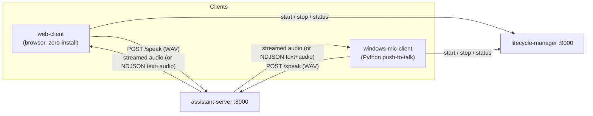

# Local AI Assistant — Mic Clients

**Part of the [Local AI Assistant](https://github.com/mattdwall100/local-assistant-server) system.**
Start there for the architecture, the headline numbers, and the full voice pipeline.

**Entirely manually coded — without AI coding agents.**

The edge clients: they capture microphone audio, send it to
[local-assistant-server](https://github.com/mattdwall100/local-assistant-server), stream the
spoken response back, and play it. The server does all the AI work (STT, LLM, tools, TTS); the
clients stay small and focused on device I/O, push-to-talk, playback, and graceful fallback.



## Clients

| Client | Status | Best for |
| --- | --- | --- |
| [`web-client/`](web-client) | ✅ implemented | **The quickest way to try the assistant.** One self-contained `index.html`, no build, no install. |
| [`windows-mic-client/`](windows-mic-client) | ✅ implemented | Desktop push-to-talk during development. |
| [`raspberry-pi-client/`](raspberry-pi-client) | 🗺️ planned | Always-on wake-word edge device. |

### web-client — zero-install browser client

A single [`index.html`](web-client) (no dependencies) that turns any modern browser into a
push-to-talk voice terminal for the assistant. Hold the mic button or the space bar to talk; it
encodes a 16-bit PCM WAV in-browser and POSTs it to `/speak` requesting the NDJSON stream, then
**demuxes text and audio in lockstep** — the transcript fills in as the paired audio plays back
gaplessly via the Web Audio API. It also shows live server status (Off → Starting → Warming up →
Ready, polled every 3s), Start/Stop buttons wired to the lifecycle manager, `Esc` to stop the
server, an `AnalyserNode` waveform, and a synthesized wake chime. This is the most demo-able
artifact in the whole system — open the file and talk.

### windows-mic-client — Python push-to-talk (86% test coverage, 30 tests)

- **Space bar to talk:** hold to record (16 kHz mono via `sounddevice`), release to POST the WAV
  to `/speak`; a new recording interrupts any in-progress playback.
- **Server lifecycle aware:** health-checks the server on startup and, if it's down, asks the
  lifecycle manager to start it and polls `/health` for up to 45s before greeting you. `Esc` asks
  the lifecycle manager to stop the server, then exits.
- **Graceful fallback:** plays a local fallback WAV when a recording is empty or the server is
  unreachable, so it never fails silently.
- Testable hardware boundaries: the mic, speaker, and network are faked/monkeypatched, so the
  suite runs without a real microphone or a live server.

## Running the Windows client

Start the assistant server first, then:

```powershell
cd windows-mic-client
.\scripts\run_client.ps1
```

Hold `Space` to record, release to send, `Esc` to shut the server down and exit.

## Testing (Windows client)

```powershell
cd windows-mic-client
.\.venv\Scripts\python.exe -m pytest
```

30 tests, **86% coverage** — API client, orchestration, fallback, config, WAV conversion,
playback streaming, and push-to-talk control flow. Boundaries (mic, network) are faked.

## Technologies

Python 3.11–3.13 · sounddevice, soundfile, NumPy · pynput · requests · Pydantic v2 ·
pytest / pytest-cov · Ruff, mypy · Docker/Compose assets. The web client is plain
HTML/CSS/JavaScript with the Web Audio API — no framework, no build.
